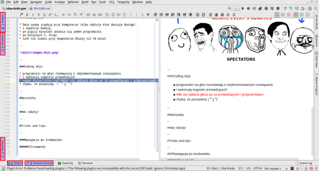

title: Idea - Dziki gon
author:
  name: Michał Rowicki i Jacek Milewski
  
style: basic-style.css
output: basic.html
controls: true

--

# IDEA - Dziki gon
## Czyli jak wykorzystać IDE, aby stało się szybkim i silnym zabójcą 

--

# Motywacja

> Kto nie używa <kbd>Ctrl</kbd> + <kbd>C</kbd> i <kbd>Ctrl</kbd> + <kbd>V</kbd> do kopiowania?  

> Kto nie używa <kbd>Del</kbd> do usuwania?  

--

### Program na dziś

* Reguły
* Warsztaty
* Tricks & Tips

--

#### Reguły

* Coding dojo
* implementacja katy TDD
* bez myszki
* ze skrótami klawiaturowymi

--

####Coding Dojo

* Dwie osoby siadają przy komputerze (albo zdalnie ktoś dostaje dostęp)
* i wspólnie kodują
* po pięciu minutach zmienia się jeden programista
* po kolejnych 5. drugi
* żadna para nie siedzi przy komputerze dłużej niż 10 minut

--

--

###Coding dojo

* programiści na głos rozmawiają o implementowanym rozwiązaniu
* i wykonują sugestie prowadzących
* sesja jest interaktywna - liczymy na Waszą aktywność

--

#Warsztaty

--

##do roboty!

--

#Tricks and tips

--

###Nawigacja po środowisku

#####Alt+numerki

--

###Alt + numerki

Dwukrotne kliknięcie kombinacji zamyka okno

--

##Nawigacja pomiędzy oknami

|Skrót|Akcja|
|:--	|--:	|
|<kbd>Esc</kbd>|Powrót do edytora|
|<kbd>Shift+Esc</kbd>|Zamknięcie okna i powrót do edytora|
|<kbd>Ctrl+Shift+F12</kbd>|Maksymalizacja edytora|
|<kbd>Enter</kbd>|Otworzenie pliku (z okna Project)|
|<kbd>F4</kbd>|Otwarcie i skok do pliku|

--

| Skrót | Akcja |
| ------ | --- |
| <kbd>Ctrl</kbd> + <kbd>y</kbd> | usunięcie obecnej linii |
| <kbd>Alt</kbd> + <kbd>Shift</kbd> + <kbd>&#x2191;</kbd> | przesuwanie linii kodu góra/dół |
| <kbd>Ctrl</kbd> + <kbd>Shift</kbd> + <kbd>&#x2191;</kbd> | przesuwanie metody / bloku kodu |
| <kbd>Alt</kbd> + <kbd>Ctrl</kbd> + <kbd>m</kbd> | wydziel metodę |
| <kbd>Ctrl</kbd> + <kbd>Shift</kbd> + <kbd>n</kbd> | otwórz plik |
| <kbd>Ctrl</kbd> + <kbd>f12</kbd> | overview obecnego pliku |
| <kbd>Alt</kbd> + <kbd>Insert</kbd> | dodaj (plik, klasę, metodę, test…) |
| <kbd>Alt</kbd> + <kbd>Shift</kbd> + <kbd>f10</kbd> | run |
| <kbd>Alt</kbd> + <kbd>9</kbd> | git log |
| <kbd>Ctrl</kbd> + <kbd>k</kbd> | git commit |
| <kbd>Ctrl</kbd> + <kbd>Shift</kbd> + <kbd>k</kbd> | git push |

-- center

#Shift Shift 

skrót do skrótów

